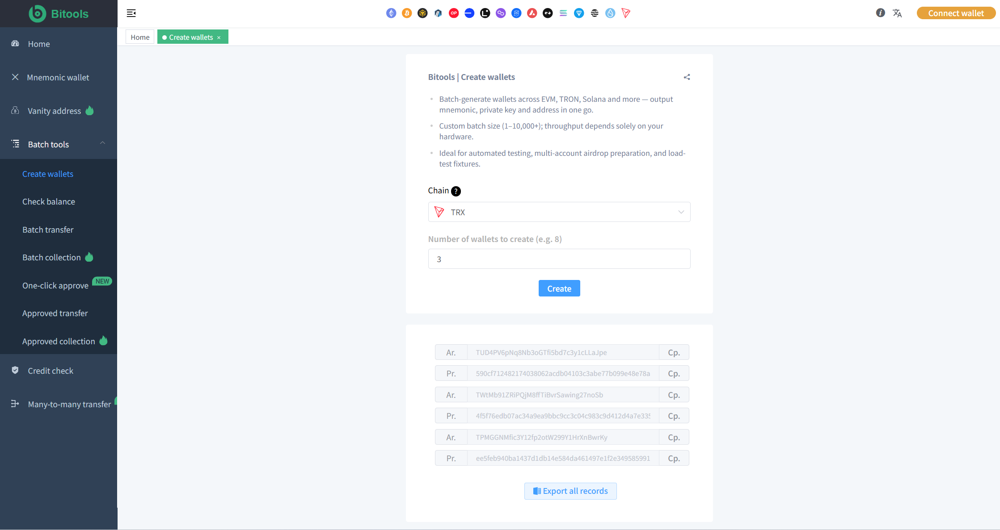
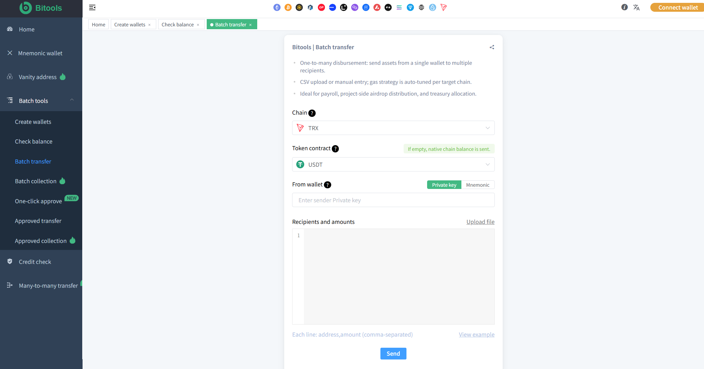

# TRX Tools

**A collection of practical TRON (TRX) tools for Web3 users, developers and wallet operators.**

[](LICENSE)
[](https://tron.network)
[](https://www.typescriptlang.org/)

---

## 📖 Overview

**Bitools TRX Tools** is designed to solve the most common and time-consuming pain points in TRON wallet and asset management.

Whether you are managing dozens or thousands of wallets, Bitools helps you complete high-frequency operations in just a few clicks:

- Batch create wallets
- Batch transfer
- Batch balance checking
- Wallet sweeping (collection)
- Authorization detection
- Multisig wallet management
- Vanity (custom) wallet generation
- Multi-chain asset management

Focus on efficiency, security and simplicity — so you can manage TRX and TRC20 assets without repetitive manual work.

---

## ✨ Features — Solving Real User Pain Points

- 🔑 **Batch Create Wallets** — Quickly generate hundreds of TRON wallets in seconds, no more manual creation one by one
- 💸 **Batch Transfer** — Send TRX or USDT (TRC20) to multiple addresses at once, saving massive time and effort
- 📊 **Batch Balance Checker** — Instantly check TRX + TRC20 balances across all your wallets
- 🧹 **Wallet Sweeping (归集)** — Automatically collect assets from multiple wallets into one main wallet
- 🔍 **Authorization Detection** — Quickly detect risky token approvals and help protect your assets
- 👥 **Multisig Wallet** — Create and manage TRON multi-signature wallets for higher security
- ✨ **Vanity Wallet (靓号)** — Generate customized TRON addresses with your preferred prefix/suffix
- 🌐 **Multi-Chain Asset Management** — Unified experience across TRON and other major chains (SOL, ETH, BNB, BASE, ARB etc.)

---

## 📸 Screenshots

<div align="center">
  
  <br/>
  <em>Main Dashboard</em>
</div>

<br/>

| Wallet Tools | Bulk Operations |
|--------------|-----------------|
|  |  |

---

## 🛠️ Core Tools

### Wallet Management
- Batch Wallet Generator
- Vanity Address Generator (靓号)
- Multi Wallet Manager

### Transfer & Collection
- TRX / TRC20 Bulk Transfer
- Wallet Sweeper / Auto Collection (批量归集)
- Multi-wallet Asset Consolidation

### Balance & Monitoring
- Batch Balance Checker
- TRX + USDT Balance Inquiry
- Real-time Asset Overview

### Security
- Authorization Detection & Revoke
- Transaction Risk Checking
- Private Key Protection Tools

### Advanced
- TRON Multisig Wallet
- Multi-signature Transaction Management
- Multi-chain Asset Dashboard

---

## Detailed Features

### Batch Create Wallets
Tired of creating wallets one by one? Generate dozens or hundreds of TRON wallets instantly.

### Batch Transfer
Send TRX or USDT to multiple addresses in a single operation — perfect for airdrops, payments or team distribution.

### Batch Balance Checker
Check all your wallets’ TRX and TRC20 balances at once. No more switching addresses manually.

### Wallet Sweeping (归集)
Automatically gather funds from multiple wallets into your main wallet, making asset management clean and efficient.

### Authorization Detection
Detect and manage token approvals to reduce security risks.

### Multisig Wallet
Create and operate multi-signature wallets for enhanced asset protection.

### Vanity Wallet (靓号)
Generate customized TRON addresses that match your brand or personal preference.

### Multi-Chain Asset Management
Manage assets across TRON and other major chains in one unified toolbox.

---

## Learn More

All tools are available at:

**[https://bitools.pro](https://bitools.pro)**

---

## Documentation

- [TRON Wallet](docs/tron-wallet.md)
- [TRON Bulk Transfer](docs/tron-bulk-transfer.md)
- [TRON Balance](docs/tron-balance.md)
- [TRON Wallet Sweeper](docs/tron-wallet-sweeper.md)
- [Authorization Detection](docs/authorization-detection.md)
- [TRON Multisig](docs/tron-multisig.md)
- [Vanity Address](docs/tron-vanity-address.md)
- [TRC20 Token](docs/trc20-token.md)

---

## Contributing

Contributions, bug reports and suggestions are welcome.

Please open an issue before making major changes.

---

## 📦 Installation

```bash
# Clone the repository
git clone https://github.com/xBitools/trx-tools.git

cd trx-tools

# Install dependencies
npm install
# or
pnpm install
# or
yarn
